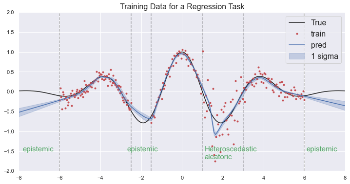

# Uncertainty in deep learning
This reposit compares the uncertainty in Gaussian Process Regression and other methods developed for deep learning such as Ensemble, Bayesian approach based on the dropout. It performs 1D regression simulations where the training data is corrupted with both epistemic and aleatoric unceratinty. Your can start with Comparison.ipynb in notebooks folder.

## Summary of results
-  Training data

Two types uncertainty in training data.

-  GP regression

Good at epistemic uncertainty. Not valid for aleatoric uncertainty. Note that there is a variation of GP regression for heteroscedastic data. Check the reference. 

-  Neural net

No generating uncertainty.

-  Ensemble 

Good at epistemic uncertainty, but somewhat underestimate the uncertainty. Not valid for aleatoric uncertainty

-  Bayeisn neural net with dropout

Valid for epistemic uncertainty, but not good.

-  Single density network

Valid only for aleatoric uncertainty. Unstable in traning process due to negative log-likelihood loss.

- Density + dropout
- Density + ensemble
- Mixture density network

## References
* Bayesiean NN based on dropout: https://arxiv.org/pdf/1703.04977.pdf
* Deep ensemble density network: https://papers.nips.cc/paper/2017/file/9ef2ed4b7fd2c810847ffa5fa85bce38-Paper.pdf
* Mixture density network: https://arxiv.org/pdf/1709.02249.pdf
* Gaussian process regression Code from Sungjoon Choi(https://github.com/sjchoi86)
* Gaussian process for heteroscedastic data (https://cs.stanford.edu/~quocle/LeSmoCan05.pdf)
